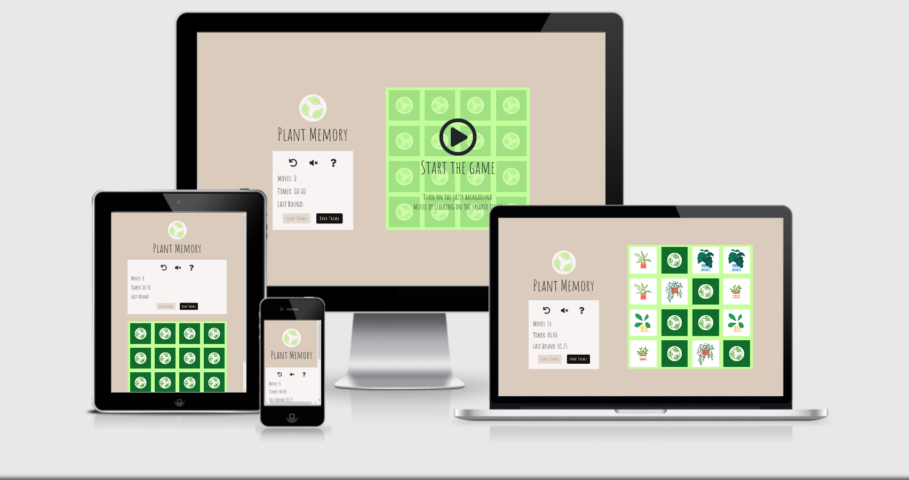

# Plant Memory
## About

Plant Memory is a memory game for everyone to enjoy. 
With its clean and stylish design together with a soft colorscheme, the game invites to a harmonious gaming 
experience with a jazzy twist. This memory game does not require any competition ambitions in the player, 
this is simply a memory game that creates peace and harmony in the person who visits the site to play. 
For many, plants represents a sense of calm, and anyone who has plants as a hobby can 
probably certify that the power of taking care of plants really brings a feeling of mindfulness to both 
body and soul. So grab a coup of tea and sit down and enjoy the simple journey of this memory game.

[Go to the Plant Memory live project here!](https://josefinekihlstrom.github.io/Plant-Memory/)

## UX
### UX goals
The UX goals is to provide the player with an inviting and responsive design that will bring the feeling of mindfulness. 
With its simple structure this memory game will be easy for everyone to navigate through without 
unclear instructions, annoying audio effects and cluttered content. The main goal is to offer the player a relaxing 
surrounding while practising their memory skills with the interactive features of this game. 

### User stories
I want to play a game...

1. ..that is fun.
2. ..that is easy to navigate through.
3. ..that doesn't require compeeting agianst the clock.
4. ..that has a nice and clean design.
5. ..that doesn't play too loud and stressing audio effects on everything I click.
6. ..that I can see what my previous score was.
7. ..that I can come back to and play to get my mind off something. With a mindfulness aspect.
8. ..that I can play to practise my memory skills.
9. ..that I can play at night with a darker theme.

### Design process
1. **Strategy plane** 
My strategy for this game was to offer a fun game experience that lets the player practise their memory skills. 
I also wanted to make the game with a mindfulness twist to it. The strategy plane was based on the user stories above.

2. **Scope plane** 
The main feature was going to be the memory game itself alongside with some other features, such as 
a 'high score list' with locally scored high scores, a timer, smooth sound effects that indicate if you win or loose
and the option to play some jazzy background music (that you also can turn off).
I also wanted the overall theme for the game to reflect through the images that I was going
to use for the cards. In this stage the images was not decided yet.

3. **Structure plane** 
When the key features was set the structure plane was pretty simple. I was going to have just a single page with
all the features in it but divided into different sections to make out the most of it and get a nice balance. 
My initial structure is based out of squares with information withing the main square that would be the 
portview. One square would contain the icon and the name of the game, another square would contain the menu with
the interaction functions and then the last square would be the memory game itself with its own features.

4. **Skeleton plane**
I started sketching out what the layout would be like and got the balance of the page together by dividing 
it into two main sections of the page. The right section of the page was going to cover the majority of the
page with the memory game feature. In the left section I wanted to add all information about the page together 
with the different features that I wanted to add in such as the buttons, icons and timer function.
I didn't want the left section to be left out entirely and decided to give it the space that it needed to 
provide the information within it as clear as possible for the player to easily understand it.

5. **Surface plane**
- When I knew how I wanted the structure to be I turned to the internet to find free images to use for my game.
I ended up on [Freepic.com](https://www.freepik.com/free-vector/potted-plants-set_8271077.htm#page=1&query=plants&position=1)
where I found the pictures of the plants that I ended up using.
- After that I turned to [Coolors](https://coolors.co/) to find colors that would match the theme of the page.
I wanted to use a soft color scheme for the default theme and ended up with the following colors:

- The logo was then made with the technology of [Free Lodge Design](https://www.freelogodesign.org).
- The font that I decided to use throuought the project was [Amatic](https://fonts.google.com/specimen/Amatic+SC?query=amatic)

#### Wireframes

Before starting the memory game.

Overlook of all card images that will be used.

When finishing the game.

Before starting the memory game **dark mode**.

Overlook of all card images that will be used **dark mode**.

When finishing the game **dark mode**.

#### Changes I made throuought the project
- Instead of adding the feature of giving the player the option to change background music I decided to replace it
with a questionmark icon in the Menu section to simply provide the player who doesn't know how to
play a memory game with information about how to play.
I'm sure however that most people today know how to play a memory game, but for me it would feel omitted not to 
share that information with the player who wants to play but doesn't know how.

- Some overall text and layout were changed in the overlays to give a better overwiev of the information 
provided in them. I added text under the play button to indicate how to start the game and encourage the 
player to get the background music started.
When the game is finished I decided to add the icon of a winning cup together with the information about how to
play the game again.

- In my original idea I wanted to store a high score in the Menu section of the page. However scoring
in a memory game is not the easiest when you play it by yourself. I therefor decided that I was going to store
the latest round played to make it possible for the player to compare their last game session with the ongoing session.
This way, for those who are a little bit more competitive, this would encourage the player with an option to try
to beat that last round time.

### Features
The game page is sectioned into two columns. In the right column the actual memory game is based and in the
left column the logo and Menu section with some other main key features are placed.

1. **The memory game column features**
    - When you first arrive to the page, the memory column where the memory cards are placed has an overlay
    which activates the player to press the play button when they want to start the game.
    - The overlay also contains information that encourages the player to start the background music that will be
    played when pressing the speaker icon in the menu section.
    - When pressing the overlay the overlay disappers and the timer starts counting. The game is started.
    - When clicking the different cards an audio is played to indicate that the card is flipped. When two cards
    match an encouraging sound effect plays.
    - When the player has matched all cards another overlay covers the memory column to indicate that the game
    is finished together with an audio playing.

2. **Menu section**
    - The Menu section includes a logo together with the name of the game and a container that includes a replay
    icon, a speaker icon, a questionmark icon, a moves counter, a timer, the last round time and two theme buttons.

3. **Replay, Speaker and Questionmark Icons**
    - When the replay icon is clicked the page reload. This allows the player to restart the game whenever it's
    needed.
    - When the speaker icon is clicked, the background music starts playing. While the background music is playing you can
    click on the speaker icon again to stop the music.
    - When the questionmark icon is clicked a modal pops up with information about how to play the game. This modal can be closed
    in two ways, by clicking on the 'X' in the upper right corner, or clicking the 'Close' button on the bottom of the modal.

4. **Moves, Timer and Last Round**
    - The number next to the text 'Moves' indicates how many times the player has made a round of clicking two
    cards in the of the ongoing game round.
    - The timer let's the player know how much time has passed since starting the game. When the game is finished
    the timer is paused.
    - The timestamp next to the 'Last Round' text indicates the time that the player finished the game in the last round of 
    playing. This to encourage the player to try to beat that time in the ongoing round. If there's no timestamp
    next to the 'Last Round' text, the player must play one round and then click on the reload icon to see the time of
    the last round that is stored.

5. **Theme Buttons**
    - The two buttons represents a theme each. When the player visits the page the light theme is automatically
    showed which makes the 'Ligh Theme' button disabled.
    When the player click on the 'Dark Theme' button the css style for that theme is switched to. This makes the
    'Dark Theme' button disabled but not the 'Light Theme' button, this to indicate which theme is currently used.

#### Features left to implement
- **Add opportunity to change music during playing.** In the original idea the third icon in the Menu column was
a 'step-forward' icon. This was suppose to include a feature to make it possible to change through different background
songs. However due to lack of time of finding the perfect songs to match the game and the page I decided to
leave this to hopefully add it in the future.
- **Pause button to pause the game while playing.** My mentor suggested that I would add a pause button for the player to be
able to pause the game while playing. This was something I tried to add to the timer function but without a working result,
I just simply couldn't get the function to pause the time as I wanted. So unfortunately I had to skip
that idé and will hopefully try to make it in the future.

### Technologies used
#### Languages
- HTML5
- CSS
- Javascript

#### Libraries
- [Bootstrap](https://getbootstrap.com/)
- [FontAwesome](https://fontawesome.com/)
- [Google Fonts](https://fonts.google.com/)
- [jQuery](https://jquery.com/)

#### Technologies
- [Free Lodge Design](https://www.freelogodesign.org)
- [Gitpod](https://www.gitpod.io/)
- [Github](https://github.com/)
- Google Chrome Developer Tool (built in the Google Chrome browser)
- Firefox Developer Tool (built in the Firefox browser)
- [Coolors](https://coolors.co/)
- [Figma](https://www.figma.com/)
- Microsoft Paint - to edit the images used.
- [Favicon](https://favicon.io/)

### Testing
[Click here to view the testing for this project!](assets/testing/testing.md)

#### Bugs found
* **Fixed!** The cards wouldn't shuffle when playing the game. Solved the problem by going back and change the cards variable 
value to javascript code instead of jquery that I wrote from the beginning. The problem must have been caused by 
a misunderstanding from my side in the code I wrote.
* **Fixed!** When you clicked too quick on the next card the card flip audio would sometimes not play. 
Probably because the sound wasn't done playing the first time clicking the card.
I solved it by putting the flip card sound to a current time of 0 when a card is clicked. This made it possible to
play the audio quickly after it's first been executed.
The code that guided me solve this bug was found [here](https://stackoverflow.com/questions/1933969/sound-effects-in-javascript-html5).
* **Fixed!** The ClearInterval function was not working to stop timer when game is finished. 
I Decided to start from scratch and make a new timer with cleaner code to hopefully get a better understanding of 
my mistake and make it work properly.
The code that guided me to rebuild my timer was found [here](https://www.youtube.com/watch?v=_a4XCarxwr8).
* **Fixed!** When testing the game on my iPhone the memory cards wouldn't turn properly when clicking on them. 
This seemed to look fine when I tried the game out in device toolbar in my Chrome browser. 
The feature of flipping the cards did not seem to be supported by Safari browsers so I solved this problem by 
adding a webkit attribute in my css code for the backface visibility.
The code that guided me to solve this bug was found [here](https://stackoverflow.com/questions/42744573/backface-visibility-not-working-in-safari/45145977).

### Deployment
This project was developed in Gitpod and then pushed to GitHub. To deploy the project the following steps were made:

1. Log in to [GitHub](https://github.com/) and go to my [GitHub profile](https://github.com/Josefinekihlstrom).
2. Select [Josefinekihlstrom/Plant-Memory](https://github.com/Josefinekihlstrom/Plant-Memory) from the repository list.
3. Select 'Settings' in the menu under the repository name.
4. Scroll down to 'GitHub Pages' section.
5. Under 'Source', select 'Master' in the dropdown menu.
6. Click 'Save' and the page will refresh.
7. Scroll back down to 'GitHub Pages' to get access to the link.

Go to the Plant Memory live website here: [Plant Memory](https://josefinekihlstrom.github.io/Plant-Memory/)

### Cloning this project
If you want to work further on my project, go ahead and clone it following these steps:

1. Go to the top of the [Josefinekihlstrom/Plant-Memory](https://github.com/Josefinekihlstrom/Plant-Memory) repository.
2. Click the button named 'Code' next to the green 'Gitpod' button.
3. Choose HTTPS and copy the URL by clicking the icon next to the URL.
4. Open Git Bash/Terminal and change the current working directory to the location where you want the cloned directory.
5. Type 'git clone' and then paste the copied URL.
6. Press 'Enter'.

To get to the source of this information: [Click here!](https://docs.github.com/en/free-pro-team@latest/github/creating-cloning-and-archiving-repositories/cloning-a-repository)

### Credits

#### Media
- [Memory Images](https://www.freepik.com/free-vector/potted-plants-set_8271077.htm#page=1&query=plants&position=1)
- [Background Music](https://www.bensound.com/royalty-free-music)
- [Soundeffect when flipping the cards](https://www.soundjay.com/button/sounds/button-20.mp3)
- [Soundeffect when getting a match](https://freesound.org/people/dersuperanton/sounds/433646/)
- [Soundeffect when winning the game](https://freesound.org/people/Fupicat/sounds/521643/)

### Acknowledgements
#### Pages used to find information
- [W3C Schools](https://www.w3schools.com/)
- [Stack Overflow](https://stackoverflow.com/)
- [Youtube](https://youtube.com/)
- [Free Code Camp](https://www.freecodecamp.org/)
- [Code The Web](https://codetheweb.blog/)
- [Scotch](https://scotch.io/)

#### Code
- Starting the game with help from [Stack Overflow](https://stackoverflow.com/questions/5299895/jquery-detecting-and-removing-an-element-clicked)
- Memory game structure with help from [freeCodeCamp.org](https://www.youtube.com/watch?v=ZniVgo8U7ek/)
- Play/pause the music function with help from [Invention Tricks](https://www.youtube.com/watch?v=wffK2OIt8u0)
- Timer function with help from [WEB CIFAR](https://www.youtube.com/watch?v=_a4XCarxwr8)
- Count moves with help from [Sandra Israel-Ovirih](https://scotch.io/tutorials/how-to-build-a-memory-matching-game-in-javascript#toc-3-moves)
- Localstorage for last played round with help from [Ethan](https://codetheweb.blog/javascript-localstorage/)

#### Thank you
Thank you to the following people:
* My mentor Sen Owonikoko.
* Slack community for helping me when I thought my project was lost forever due to a dockerfile change.

### Disclaimer
This website was created for educational use only.